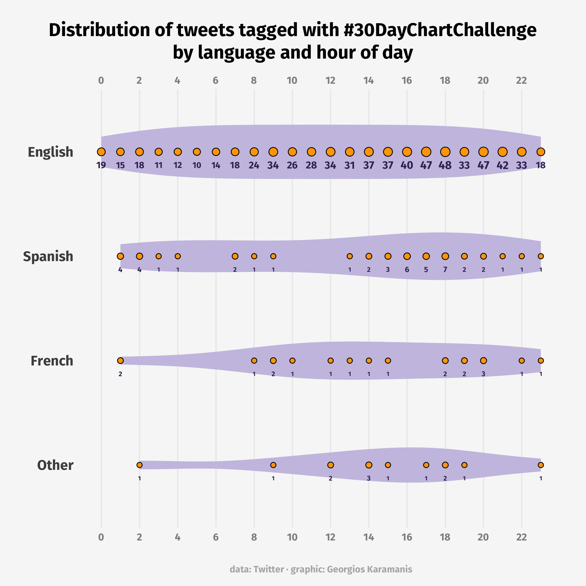
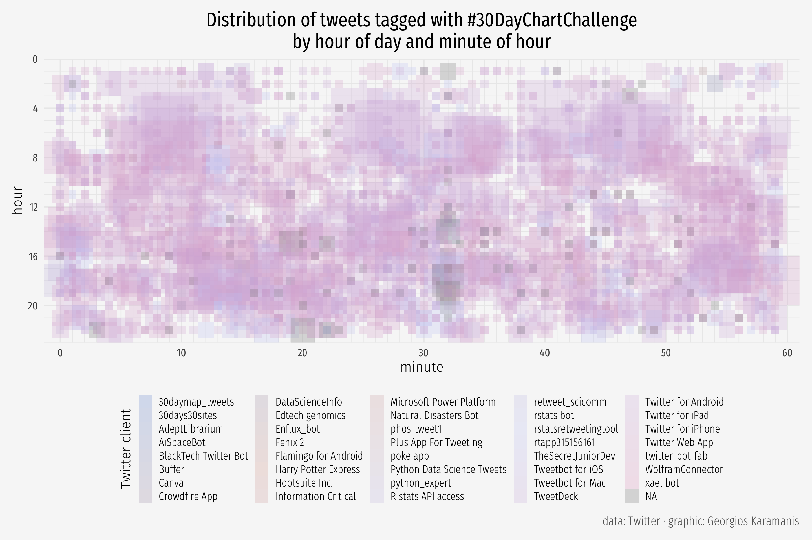
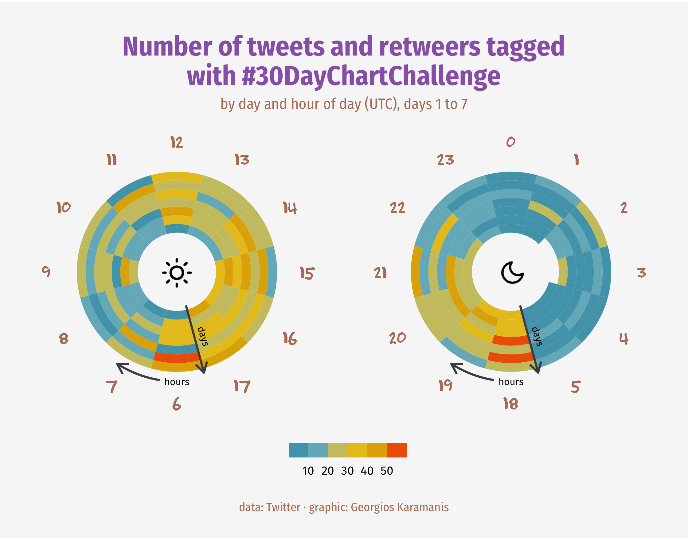
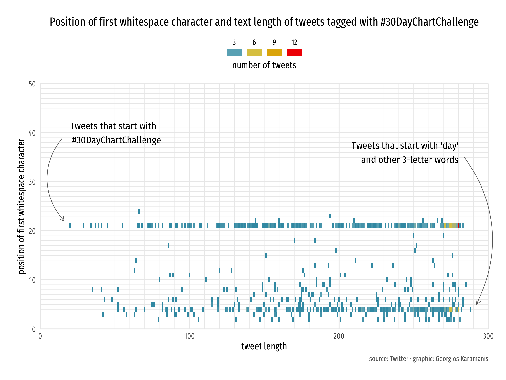
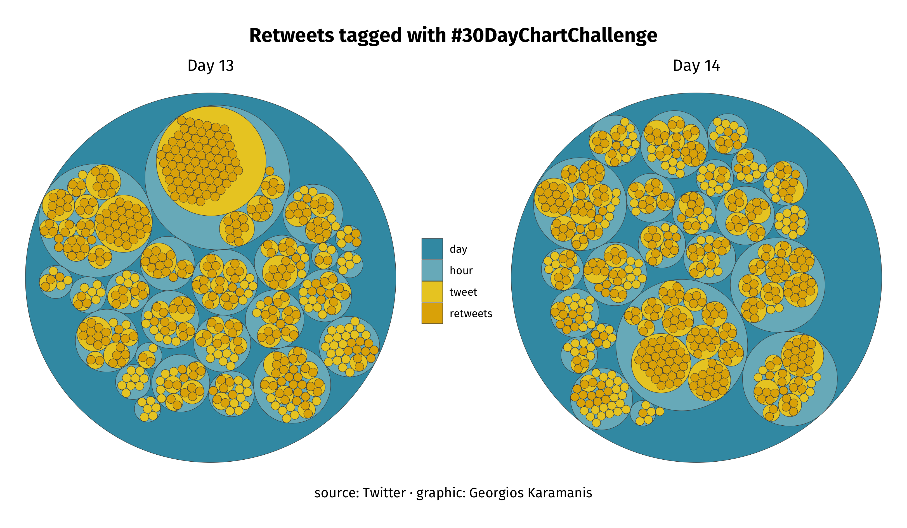
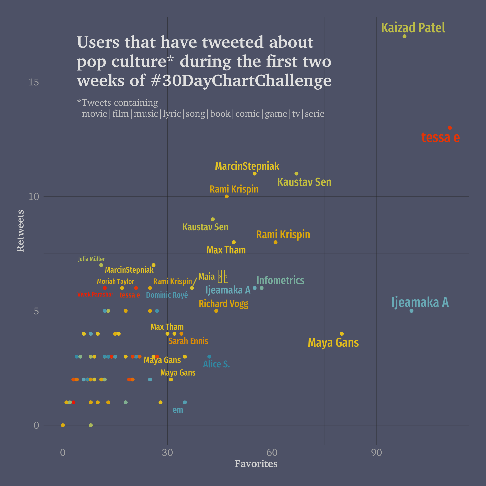
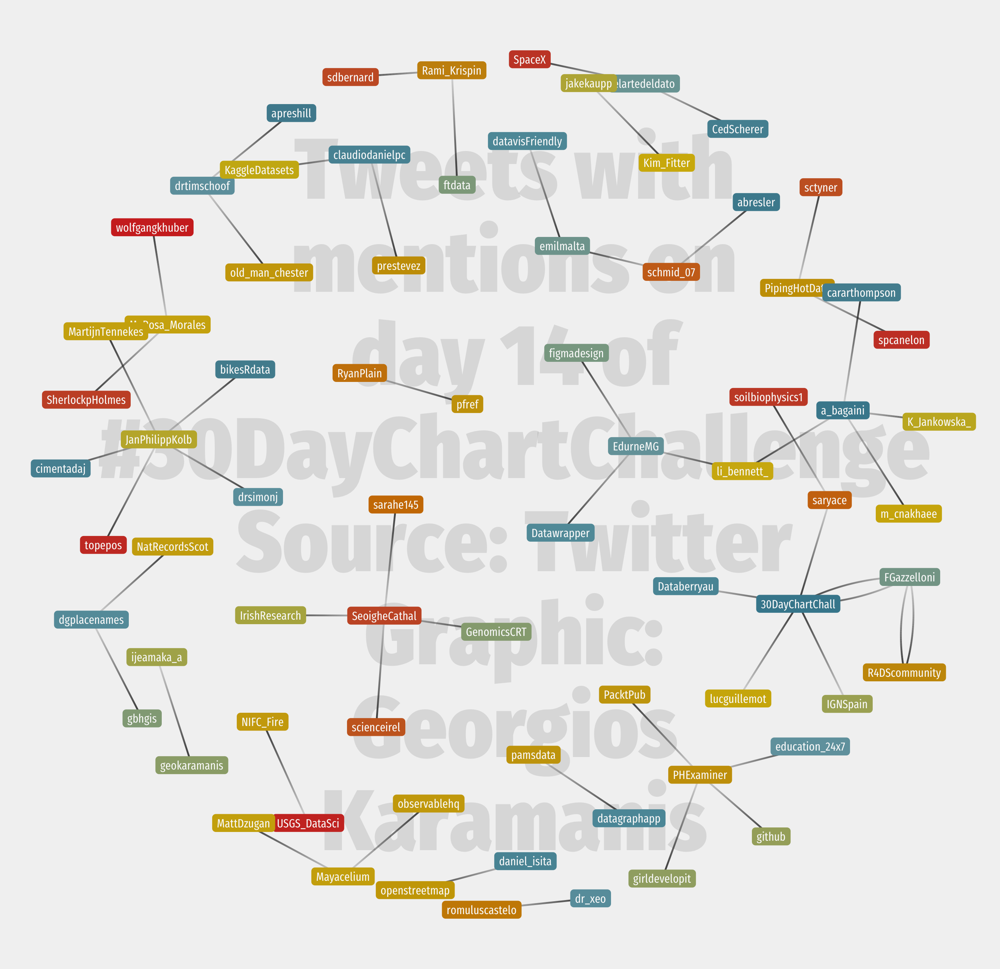
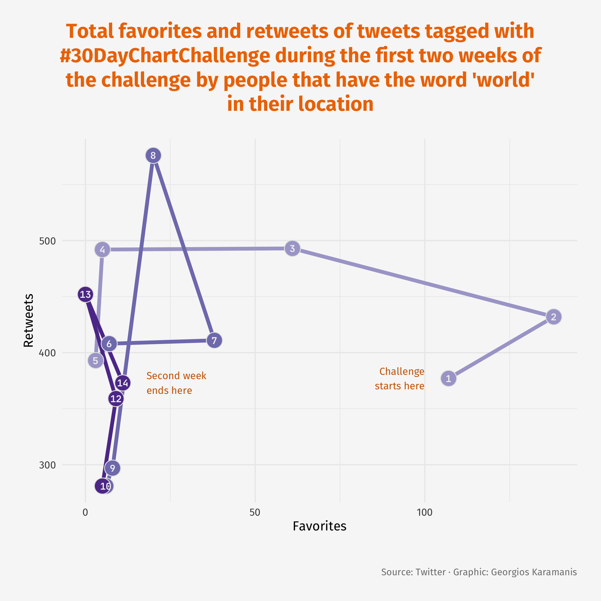
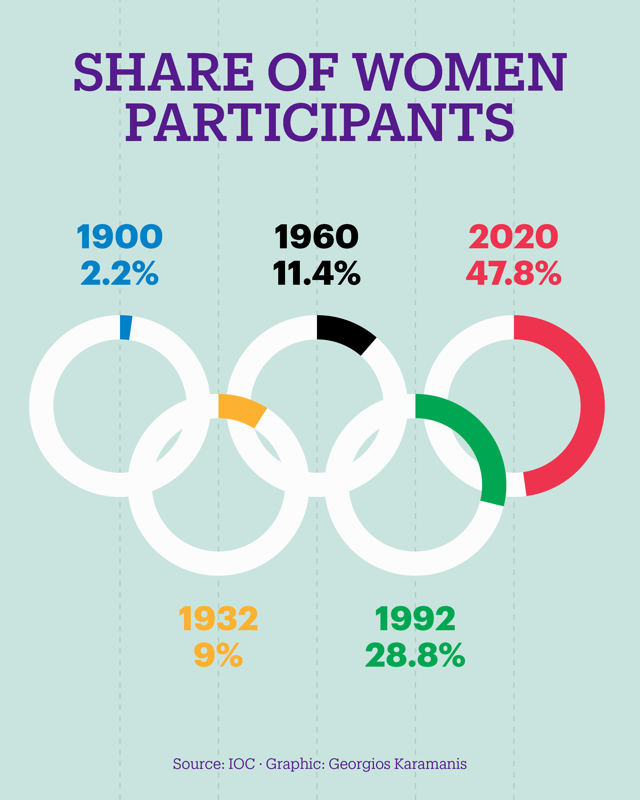

# 30DayChartChallenge

<!-- badges: start -->
<!-- badges: end -->

Submissions to the [#30DayChartChallenge](https://github.com/Z3tt/30DayChartChallenge_2021)

# 2021
<table>
    <tr>
        <td></td>
        <td></td>
    </tr>
    <tr>
        <td>!</td>
        <td></td>
    </tr>
    <tr>
        <td></td>
        <td></td>
    </tr>
    <tr>
        <td></td>
        <td></td>
    </tr>
    <tr>
        <td>!</td>
        <td></td>
    </tr>
    <tr>
        <td></td>
        <td></td>
    </tr>
</table>

# 2024  
<table>
    <tr>
        <td></td>
        <td></td>
    </tr>
</table>
  

  