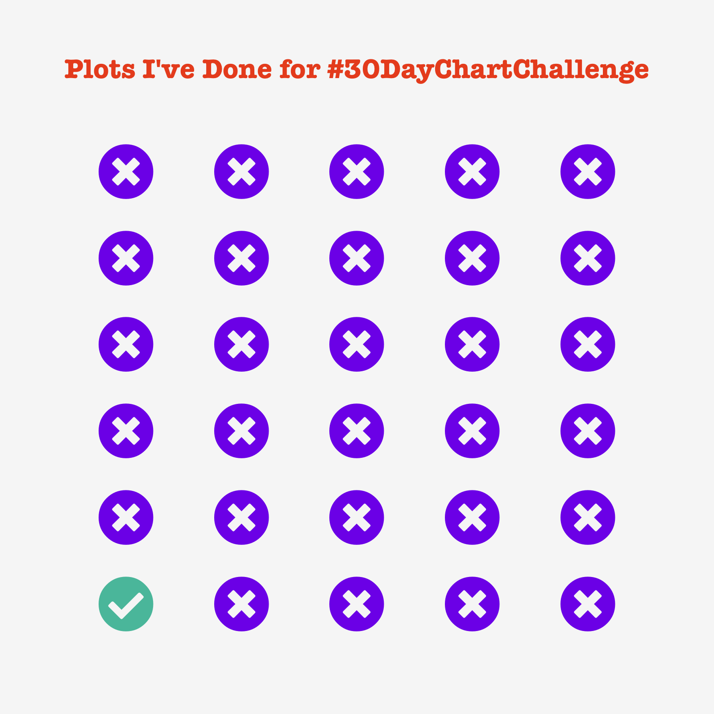
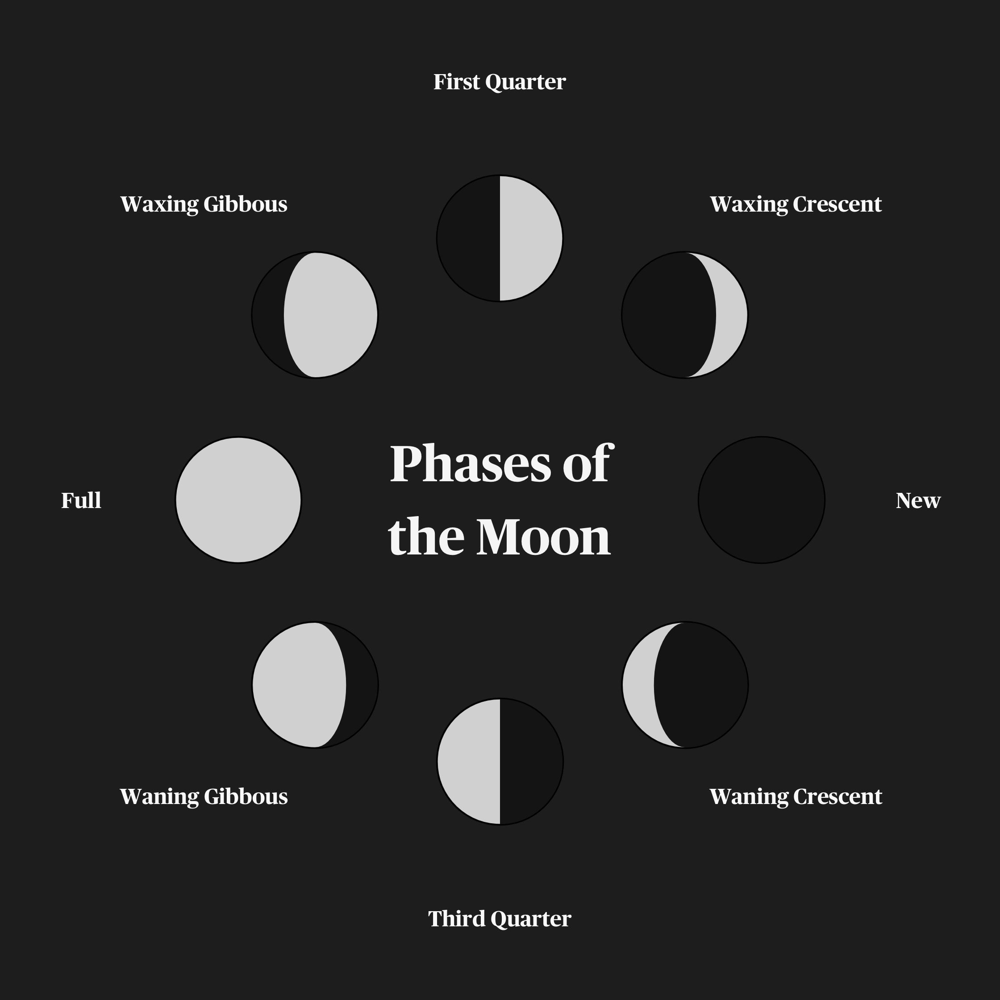
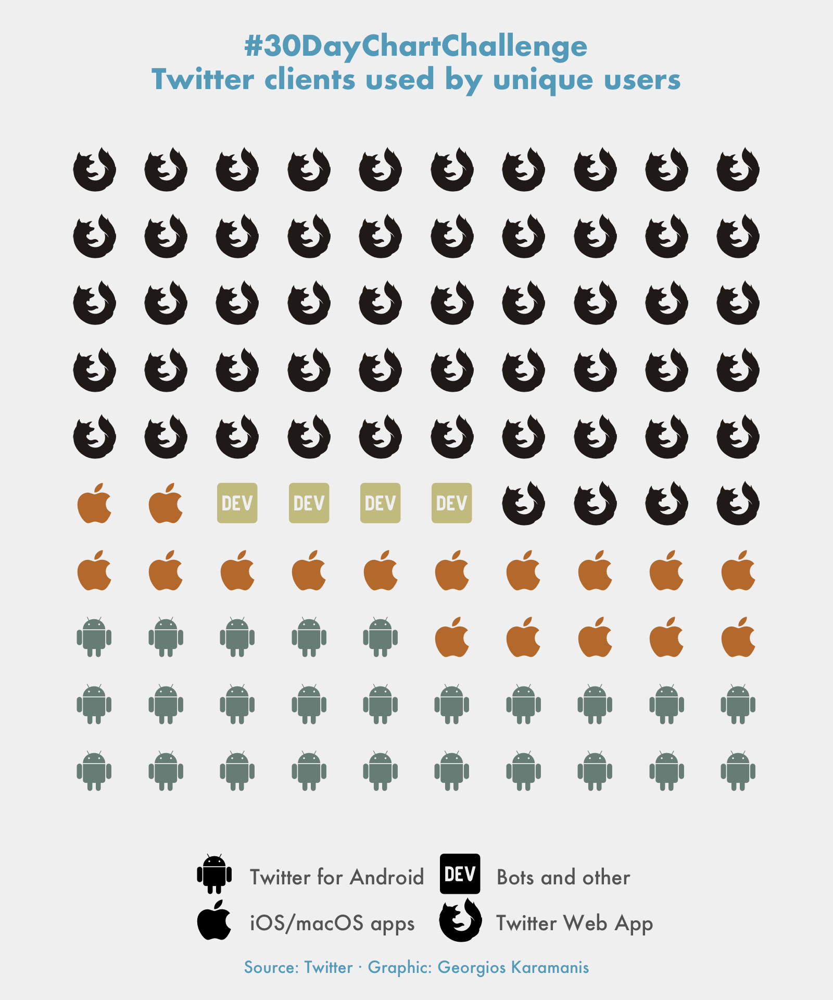
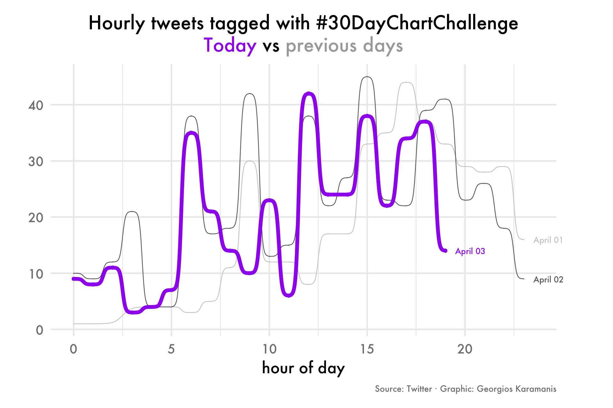
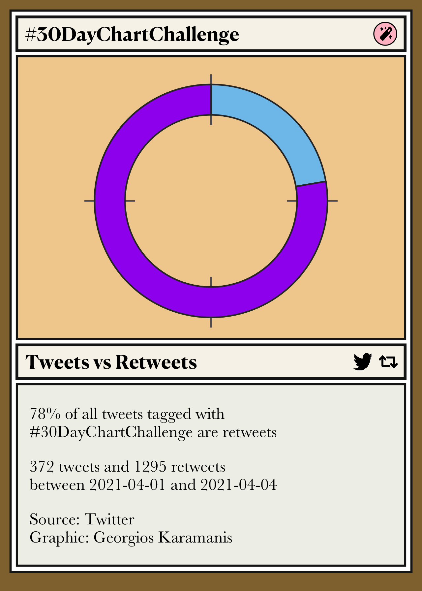
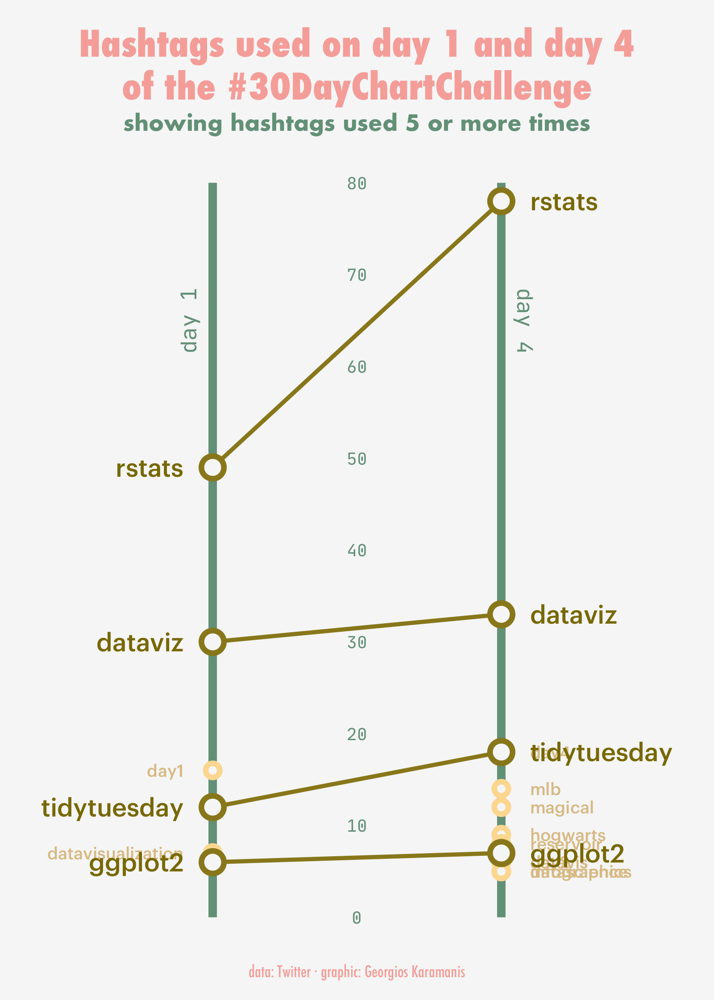
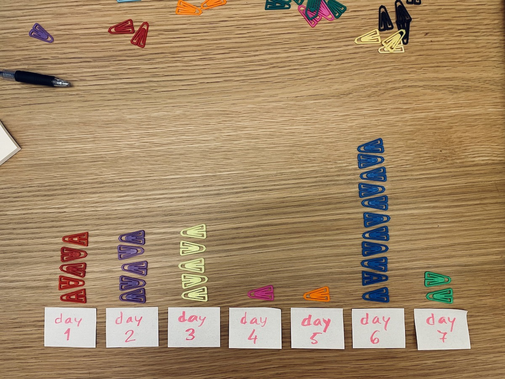
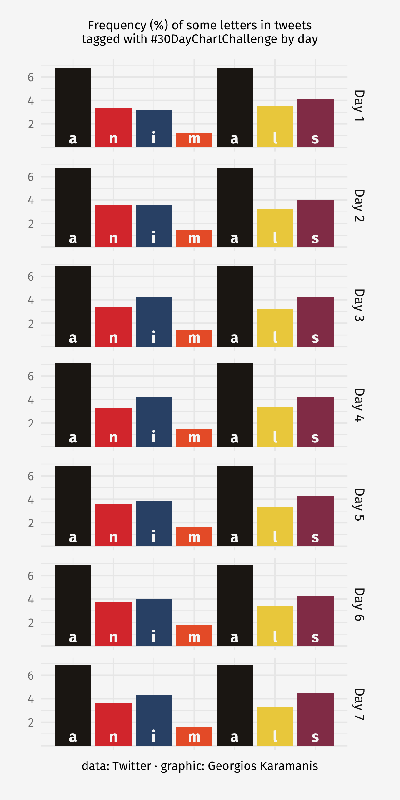

# 30DayChartChallenge

<!-- badges: start -->
<!-- badges: end -->

Submissions to the [#30DayChartChallenge](https://github.com/Z3tt/30DayChartChallenge_2021)

# Day 1, part-to-whole  
  

# Day 2, pictogram  
  

# Day 3, historical
  

# Day 4, magical
  

# Day 5, slope
  

# Day 6, experimental
[video](2021/day-6-experimental/r.mp4  

# Day 7, physical
  

# Day 8, animals
  

  