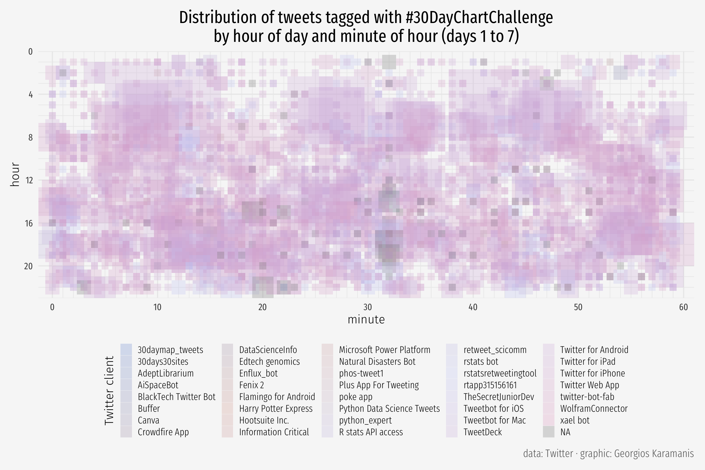

# 30DayChartChallenge

<!-- badges: start -->
<!-- badges: end -->

Submissions to the [#30DayChartChallenge](https://github.com/Z3tt/30DayChartChallenge_2021)

# 2021
# Comparisons
## Day 1, part-to-whole  
  

## Day 2, pictogram  
  

## Day 5, slope
  

## Day 6, experimental
[video](2021/day-6-experimental/r.mp4)  

# Distributions
## Day 9, statistics
  

## Day 10, abstract
  

## Day 11, circular
  

# Relationships
## Day 14, space
  

## Day 16, trees
 

## Day 17, pop culture
  

## Day 18, connections
  

# Timeseries
## Day 19, global change
  

# 2024  
# Comparisons  
## Day 1: part-to-whole  
  

  